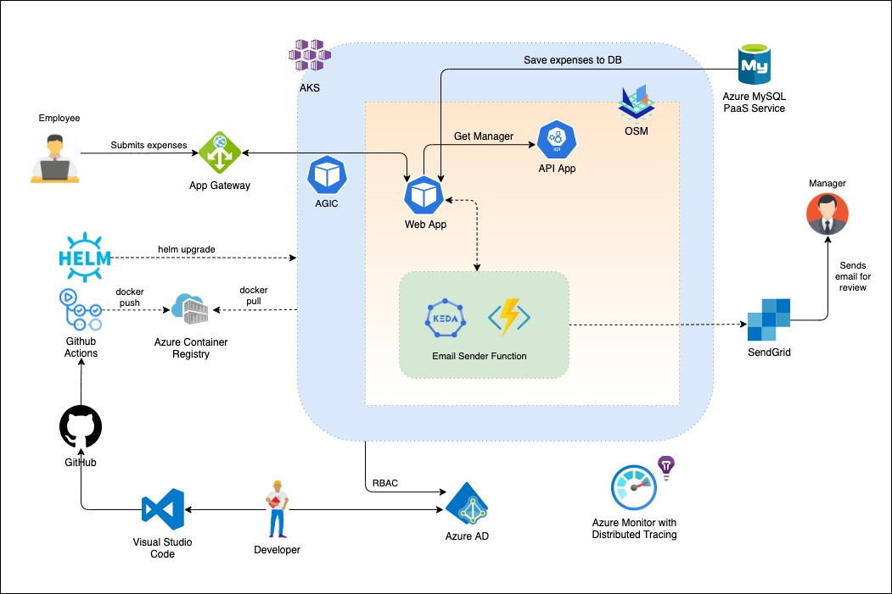

# Multi-tiered expense application

## Overview

This article demonstrates a multi-tiered application to Azure Kubernetes Service deployment with Managed Azure Services and workflow automation

## Architecture



## Setup

We will create and setup the infrastructure including the following services:

1. Azure Container Registry for storing images
2. AAD Enabled, Managed AKS Cluster with the below addons and components
   1. Application Gateway Ingress Controller Addon
   2. Monitoring Addon
   3. LetsEncrypt for Certificate authority
   4. KEDA runtime for Azure Functions on Kubernetes clusters
   5. Open Service Mesh
3. Github repository with Github Actions
4. Azure Database for MySQL Service
5. DNS Zone for custom domain
6. SendGrid Account for email service

### Cluster Creation

#### Initialize variables

```bash
RG='CNCF-Azure-RG'
CLUSTER_NAME='cncfazcluster'
LOCATION='westus'
AppGtwy='CNCFAppGtwy'
ACR='cncfazure'
domainName='sarwascloud.com'
MYSQL='expensedbserver'
adminUser='expenseadmin'
mysqlPwd='Azure1234!@#$'
KeyVault='expensesvault'
```

#### Login to Azure

```bash
az login
```

#### Create Resource Group

```bash
az group create --name $RG --location $LOCATION
```

#### Create ACR

```bash
az acr create --resource-group $RG --name $ACR --sku Standard
```

#### Get Object ID of the AAD Group (create AAD Group and add the members, in this case: fta-cncf-azure)

```bash
objectId=$(az ad group list --filter "displayname eq 'fta-cncf-azure'" --query '[].objectId' -o tsv)
```

#### Create an AKS-managed Azure AD cluster with AGIC addon and AAD Pod Identity

```bash
az aks create \
    -n $CLUSTER_NAME \
    -g $RG \
    --network-plugin azure \
    --enable-managed-identity \
    -a ingress-appgw --appgw-name $AppGtwy \
    --appgw-subnet-prefix "10.2.0.0/16" \
    --enable-aad \
    --enable-pod-identity \
    --aad-admin-group-object-ids $objectId \
    --generate-ssh-keys \
    --attach-acr $ACR
```

#### Add Public IP to custom domain

```bash
# Get Node Resource Group
nodeRG=$(az aks show --resource-group $RG --name $CLUSTER_NAME --query nodeResourceGroup -o tsv)

# Get Public IP created by App Gtwy in AKS created cluster
appIP=$(az network public-ip show -g $nodeRG -n $AppGtwy-appgwpip --query ipAddress -o tsv)

# Create DNS zone 
az network dns zone create -g $RG -n $domainName

# Once created, add Nameservers in the domain provider (eg go daddy, may take sometime to update the name servers)

az network dns record-set a add-record --resource-group $RG --zone-name $domainName --record-set-name "aks" --ipv4-address $appIP
```

### Connect to the Cluster

#### Merge Kubeconfig

```bash
az aks get-credentials --resource-group $RG --name $CLUSTER_NAME --admin
```

#### Install Cert Manager

```bash
# Install the CustomResourceDefinition resources separately
# Note: --validate=false is required per https://github.com/jetstack/cert-manager/issues/2208#issuecomment-541311021
kubectl apply -f https://raw.githubusercontent.com/jetstack/cert-manager/release-0.13/deploy/manifests/00-crds.yaml --validate=false

# Create the namespace for cert-manager
kubectl create namespace cert-manager

# Label the cert-manager namespace to disable resource validation
kubectl label namespace cert-manager cert-manager.io/disable-validation=true

# Add the Jetstack Helm repository
helm repo add jetstack https://charts.jetstack.io

# Update your local Helm chart repository cache
helm repo update

# Install v0.11 of cert-manager Helm chart
helm install cert-manager --namespace cert-manager --version v0.13.0 jetstack/cert-manager

# Install Cluster Issuer (change email address)
kubectl apply -f yml/clusterissuer.yaml

# Test a sample application. The below command will deploy a Pod, Service and Ingress resource. Application Gateway will be configured with the associated rules.
kubectl apply -f yml/Test-App-Ingress.yaml

# Clean up after successfully verifying AGIC
kubectl delete -f yml/Test-App-Ingress.yaml

```

#### Install KEDA runtime

```bash
helm repo add kedacore https://kedacore.github.io/charts
helm repo update
kubectl create namespace keda
helm install keda kedacore/keda --namespace keda
```

#### Create MySQL managed service (basic sku) and add Kubernetes public ip in it firewall rules

```bash
az mysql server create --resource-group $RG --name $MYSQL --location $LOCATION --admin-user $adminUser --admin-password $mysqlPwd --sku-name B_Gen5_2
az mysql server firewall-rule create --name allowip --resource-group $RG --server-name $MYSQL --start-ip-address <Kubernetes Public IP> --end-ip-address <Kubernetes Public IP>
```

#### Login to MySQL (you may need to add you ip to firewall rules as well)

```bash
mysql -h expensedbserver.mysql.database.azure.com -u expenseadmin@expensedbserver -p
show databases;

CREATE DATABASE conexpweb;

CREATE DATABASE conexpapi;
USE conexpapi;

CREATE TABLE CostCenters(
   CostCenterId int(11)  NOT NULL,
   SubmitterEmail text NOT NULL,
   ApproverEmail text NOT NULL,
   CostCenterName text NOT NULL,
   PRIMARY KEY ( CostCenterId )
);

INSERT INTO CostCenters (CostCenterId, SubmitterEmail,ApproverEmail,CostCenterName)  values (1, 'user1@mycompany.com', 'user1@mycompany.com','123E42');
INSERT INTO CostCenters (CostCenterId, SubmitterEmail,ApproverEmail,CostCenterName)  values (2, 'user2@mycompany.com', 'user2@mycompany.com','456C14');
INSERT INTO CostCenters (CostCenterId, SubmitterEmail,ApproverEmail,CostCenterName)  values (3, 'user3@mycompany.com', 'user3@mycompany.com','456C14');

USE conexpapi;
GRANT ALL PRIVILEGES ON *.* TO 'expenseadmin'@'%';

USE conexpweb;
GRANT ALL PRIVILEGES ON *.* TO 'expenseadmin'@'%';
```

#### Create Azure Keyvault for saving secrets

```bash
az keyvault create --location $LOCATION --name $KeyVault --resource-group $RG
```

#### Add corresponding secrets to the create KeyVault

1. MySQL Connection strings (choose ADO.NET) - both for API and Web
   1. mysqlconnapi
   2. mysqlconnweb
2. Storage Connection strings
   1. storageconn
3. Sendgrid Key
   1. sendgridapi

#### Prepare Github Actions

```bash
# Get Resource Group ID
groupId=$(az group show --name $RG --query id -o tsv)

# Create Service Principal and save the output
az ad sp create-for-rbac --scope $groupId --role Contributor --sdk-auth

# Get ACR ID
registryId=$(az acr show --name $ACR --query id --output tsv)

# Assign ACR Push role
az role assignment create \
  --assignee <ClientId> \
  --scope $registryId \
  --role AcrPush

# Get read access to KeyVault
az keyvault set-policy -n $KeyVault --secret-permissions get list --spn <ClientId>

# Install CSI Provider for Azure Keyvault

helm repo add csi-secrets-store-provider-azure https://raw.githubusercontent.com/Azure/secrets-store-csi-driver-provider-azure/master/charts
helm install csi csi-secrets-store-provider-azure/csi-secrets-store-provider-azure

# Create CSI Provider Class

kubectl apply -f yml/csi-sync.yaml

# Now you are ready to trigger the build and release from Github Actions using the provided Actions file.
```
